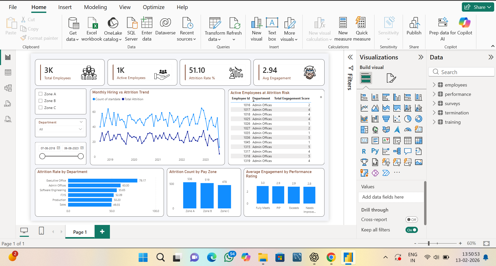

## Project Overview
This project analyzes employee data to understand attrition trends, salary distribution, hiring patterns, and workforce insights using SQL and Power BI.
The objective is to help organizations make data-driven HR decisions and reduce employee attrition.

## Project Objectives
- Analyze employee attrition rate
- Identify high turnover departments
- Study salary impact on attrition
- Track hiring trends
- Build interactive HR dashboard

## Tools & Technologies Used
- SQL (MySQL)
- Power BI
- Excel
- GitHub

## Dataset Details
The dataset contains:
- Employee ID
- Department
- Job Role
- Salary
- Experience
- Attrition
- Hiring Date

## SQL Analysis Performed
- Total employees by department
- Attrition rate calculation
- Salary distribution
- Experience vs attrition
- Department-wise analysis
- Data filtering using WHERE, GROUP BY, HAVING

## Power BI Dashboard Features
- Total Employees KPI
- Attrition Rate KPI
- Attrition by Department (Bar Chart)
- Salary vs Attrition (Column Chart)
- Hiring Trend (Line Chart)
- Interactive Slicers
  
## Key Insights
- Highest attrition in Sales department
- Low salary employees leave more
- Majority attrition in first 2–3 years
- Hiring increased in recent year

## Dashboard Screenshot

## Files in Repository
- HR_Analytics_Dashboard.pbix
- dataset.xlsx / csv
- SQL_Queries.sql
- dashboard.png
- README.md

## How to Use
1. Download dataset
2. Run SQL queries in MySQL
3. Open Power BI dashboard file
4. Explore insights
